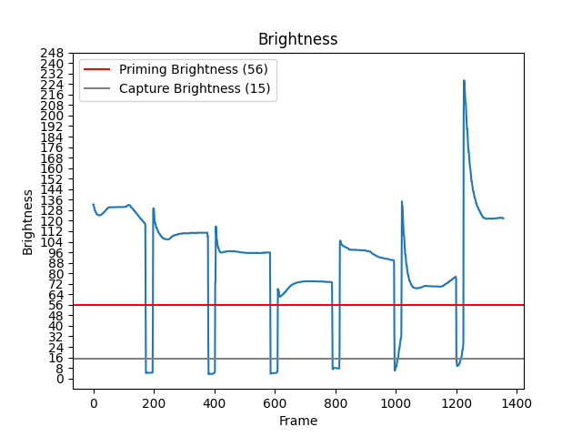

# Slide Scanning Tools

Tools to process photos and videos of projected slides.

### Setup

1. Ensure [Python](https://www.python.org/downloads) is installed and up to date (tested using Python 3.11).
2. Install dependencies with `pip install -r requirements.txt`.

### Processing Video

Turn a video recording of a slide projector flipping through slides into a directory of photos.

#### How to Use

1. Start the script with `python src/process_video.py <INPUT_PATH>` which will use default parameters.
2. Drag the red circles into the corners of the slide. Press enter when finished.
    - The image displayed is an average of all photos loaded so far.
3. Wait for the script to transform all images.
4. View the results in the specified output directory (defaults to `./output`).
5. View the brightness graph in the specified output path (defaults to `./brightness.png`)
    - If not all slides are captured, or duplicate slides are captured, reference the brightness graph and tweak the
      priming and capture brightness using the flags below.
    - The priming brightness should be just below the shortest peak.
    - The capture brightness should be just above the shallowest dip.

#### Example Brightness Graph With Suitable Thresholds

#### Optional Parameters

| Name               | Flag | Default           | Description                                                                                                                                                                                     |
|--------------------|------|-------------------|-------------------------------------------------------------------------------------------------------------------------------------------------------------------------------------------------|
| Output             | `-o` | `./output`        | The output path. The directory will be created if it does not exist.                                                                                                                            |
| Aspect Ratio       | `-a` | `3:2`             | The aspect ratio of the resulting images. This depends on the type of slides you are scanning.                                                                                                  |
| Priming Brightness | `-p` | `75`              | How bright the frame needs to be before priming. Too low and you may capture duplicates, too high and you may miss slides.                                                                      |
| Capture Brightness | `-c` | `10`              | How dim the frame needs to be before capturing. Too low and you may miss slides, too high and you may capture before the exposure has fully adjusted.                                           |
| Backtrack Time     | `-b` | `50`              | How many milliseconds to backtrack when capturing. Too low and you may capture slide transitions, too high and you may capture before the exposure has fully adjusted.                          |
| Start Frame        | `-s` | `0`               | The frame number processing starts at.                                                                                                                                                          |
| End Frame          | `-e` | `None` (no limit) | The frame number processing ends at.                                                                                                                                                            |
| Corners            | `-n` | `None` (prompt)   | A JSON array of the starting positions of each corner. Useful if the camera and projector have not moved between runs, or if you want to keep the corners constant while tweaking other values. |
| Scale Down         | `-d` | `2`               | The factor to scale down pygame window sizes by. If the pygame window extends beyond the edges of your screen, consider increasing this factor.                                                 |

### Processing Photos

Transform and rotate a directory of photos of a slide projector screen.

#### How to Use

1. Start the script with `python src/process_photos.py -t -r <INPUT_PATH>` which will use default parameters and perform both transforms and rotations.
2. Drag the red circles into the corners of the slide. Press enter when finished.
    - The image displayed is an average of all photos loaded so far.
3. Wait for the script to transform all images.
4. Rotate images using the arrow keys, press the corresponding number keys to choose a slide to save and advance or backspace to go back one slide.
    - If "Images Per Slide" is 1, the "1" number key will be the only option to advance.
    - The window will automatically close once its gone through all slides.
5. Wait for the script to rotate all images.
6. View the results in the specified output directory (defaults to `./output`).

#### Optional Parameters

| Name             | Flag | Default    | Description                                                                                                                                                  |
|------------------|------|------------|--------------------------------------------------------------------------------------------------------------------------------------------------------------|
| Output           | `-o` | `./output` | The output path. The directory will be created if it does not exist.                                                                                         |
| Aspect Ratio     | `-a` | `3:2`      | The aspect ratio of the resulting images. This depends on the type of slides you are scanning.                                                               |
| Corners          | `-n` | `None`     | A JSON array of the starting positions of each corner. Useful if the camera and projector have not moved between runs.                                       |
| Images Per Slide | `-i` | `1`        | How many images in the input folder represent one slide. This is useful if your camera saves multiple photos per slide. Only the latest image will be saved. |
| Transform        | `-t` | `off`      | Perform an initial pass using the corners to transform each image to account for rotation and skew.                                                          |
| Rotate           | `-r` | `off`      | Perform a second pass using the arrow keys to optionally rotate each image.                                                                                  |
| Scale Down       | `-d` | `2`        | The factor to scale down pygame window sizes by. If the pygame window extends beyond the edges of your screen, consider increasing this factor.              |
| Year             | `-y` | `None`     | Changes the dates on all photos to the set year. Each photo will be set to one minute after the previous.                                                    |
